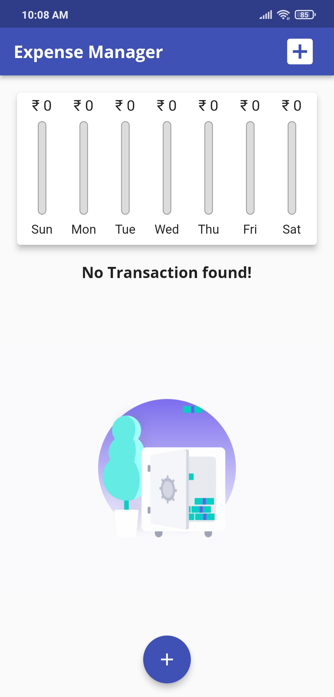
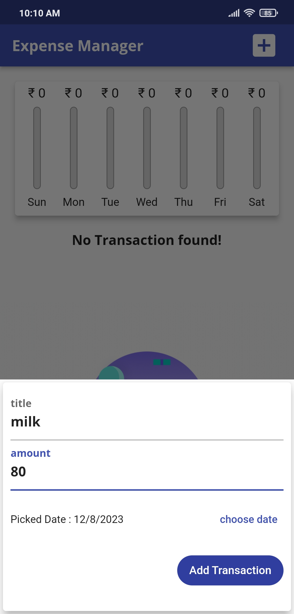
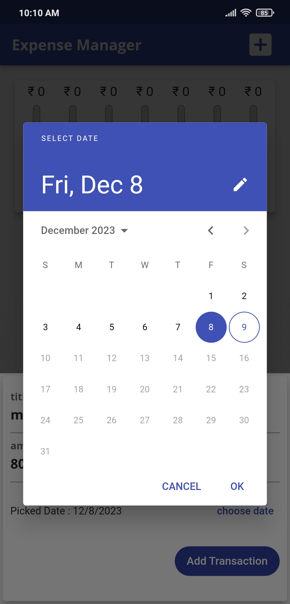
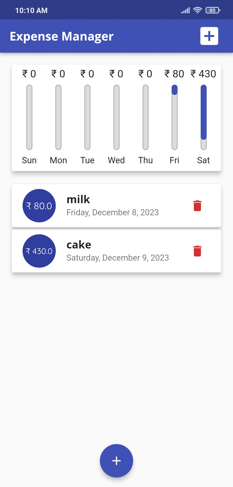

# Expense Manager Flutter App


An intuitive Expense Manager Flutter app to help you keep track of your finances on the go.

## Features

- **Expense Tracking:** Record and categorize your daily expenses.
- **Income Management:** Track your income sources for better financial visibility.
- **Visual Insights:** View charts and graphs for a clear overview of your spending habits.

## Why Choose Expense Manager?

- **Simplicity:** User-friendly design for effortless navigation and quick expense recording.
- **Versatility:** Suitable for personal and business finance management.
- **Visual Analytics:** Visualize your financial data to make informed decisions.
- **Always Accessible:** Manage your finances on-the-go with our mobile app.

## Screenshots






## Getting Started

Follow these steps to get the app up and running on your local machine.

### Prerequisites

- [Flutter](https://flutter.dev/docs/get-started/install)
- [Dart](https://dart.dev/get-dart)

### Installation

1. Clone the repository:

   ```bash
   git clone https://https://github.com/Sahilumraniya/Expense-manager-Flutter-App
